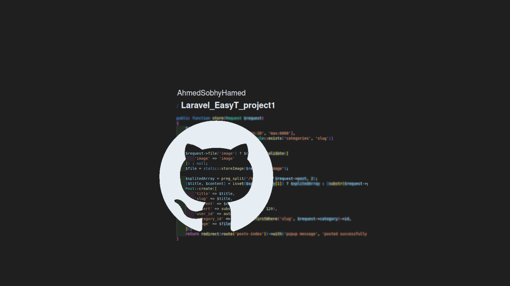
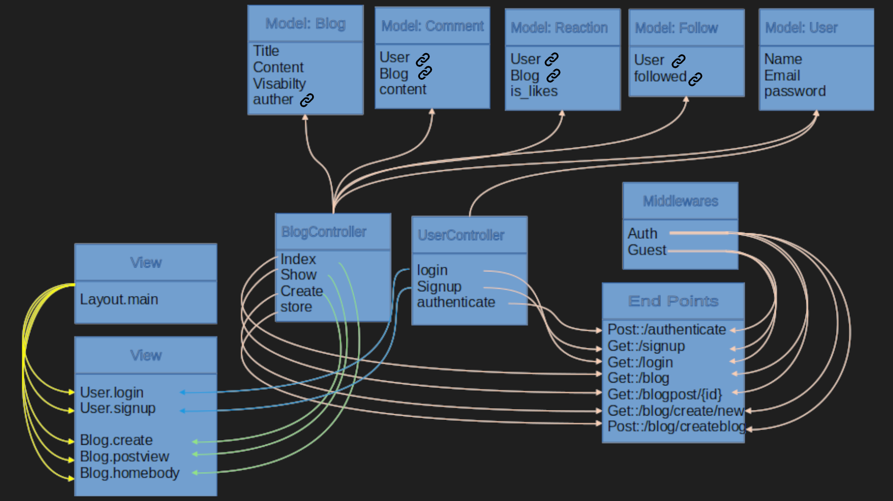

# Laravel_EasyT_project1

A small not completed blog system, and my first Laravel project.


## Table of Contents

-   [Introduction](#introduction)
-   [Features](#features)
-   [Installation](#installation)
-   [Usage](#usage)
-   [Technologies Used](#technologies-used)
-   [Project Structure](#project-structure)
-   [License](#license)
-   [Contact](#contact)

  <!-- intro -->

## Introduction

this project just a practicing while i learing Laravel.
<br>
with lot of masy code and not completed futures, i created a blog system that can create and show posts for how have the permition. the permition given when the post is created. and you can upgrade users permitions by follow users each other.
<br>
every post have comments section.
<br>
and there is a form for login or signup the user.

  <!-- technologies was used with links if available -->

## Features

    ```diff
        Using MVC architicture.
        Using Laravel Authentication system.
        Validating users data.
        Using ORM Laravel elequent models.
        Using yeild-section blade approch
        Using middleware.
        Using fake data for testing.
    ```

  <!-- get start and how to run with the prerequisites mintion -->

## Installation

1. install pre-requisies utilities

    - install php
      on Ubuntu, Debian, and Linux Mint:

        ```sh
        sudo apt-get install php8.1 php8.1-cli php8.1-common php8.1-curl php8.1-mysql
        ```

    - install mysql
      on Ubuntu, Debian, and Linux Mint:

        ```sh
        sudo apt-get install mysql-client-8.0 mysql-client-core-8.0 mysql-server-core-8.0
        ```

    - install composer
      on Ubuntu, Debian, and Linux Mint:

        ```sh
        sudo apt-get install composer
        ```

    - install npm
      on Ubuntu, Debian, and Linux Mint:

        ```sh
        sudo apt-get install nodejs npm
        ```

2. Clone the repository:

    ```sh
    git clone https://github.com/AhmedSobhyHamed/Laravel_EasyT_project1.git
    ```

3. Navigate to the project directory:

    ```sh
    cd work_directory
    ```

4. Install dependencies:

    - laravel dependencies

        ```sh
        compose install
        ```

    - node dependencies

        ```sh
        npm install
        ```

5. Set up environment variables:

    ```sh
    cp .env.example .env
    ```

6. Link storage to public folder:

    ```sh
    php artisan storage:link
    ```

7. Create Database and User:

    - open mysql

        ```sh
        sudo mysql
        ```

    - create database

        ```sh
        CREATE DATABASE eayst-database;
        ```

    - create user

        ```sh
        CREATE USER IF NOT EXISTS
        'easytUser'@'localhost' IDENTIFIED WITH caching_sha2_password BY 'password'
        REQUIRE NONE
        WITH MAX_CONNECTIONS_PER_HOUR 1800 MAX_USER_CONNECTIONS 5
        PASSWORD EXPIRE NEVER FAILED_LOGIN_ATTEMPTS 5 PASSWORD REQUIRE CURRENT PASSWORD_LOCK_TIME 1;
        ```

    - grant privilages

        ```sh
        GRANT INSERT,UPDATE,DELETE,SELECT,CREATE,DROP,ALTER,REFERENCES ON `eayst-database`.* TO 'easytUser'@'localhost';
        FLUSH PRIVILEGES;
        ```

8. Migrate tables:

    ```sh
    php artisan migrate
    ```

9. Adding fake data for testing perpose (optional):

    - open tinker

        ```sh
        php artisan tinker
        ```

    - fakeing data and use factory

        ```sh
        App\Models\User::factory(20)->create();
        App\Models\Follow::factory(10)->create();
        App\Models\Blog::factory(50)->create();
        App\Models\Comment::factory(80)->create();
        App\Models\Reaction::factory(80)->create();
        ```

    **careful: this action might fail, because of code typed in inproper way.**
    **do not ppanic and try the line it fail one more time**
    **fails not means its not work, but it works half the way**

10. Start the application:

    ```sh
    php artisan serve
    ```

    then open the browser to the linke typed in the terminal.

  <!-- usage or how to interact with this technologies like api end points and what they do -->

## Usage

**You can interact with the project via this link**
[web page on github](https://ahmedsobhyhamed.github.io/JS_PROJECTS/).
<br>
**[see an example for user interaction.[video]](http://youtube.com)**

#### interacting with end points in browser:

1. Register for an account or log in with existing credentials

    ```diff
    http://localhost:8000/login
    http://localhost:8000/signup
    ```

2. View all posts that you have access to.

    ```diff
    http://localhost:8000/blog
    ```

3. View a spesifice post with his comments and reactions.

    ```diff
    http://localhost:8000/blogpost/{id}
    ```

4. Create new post page.

    ```diff
    http://localhost:8000/blog/create
    ```

## Technologies Used

-   languages:

    -   PHP
    -   mysql
    -   HTML 5.
    -   CSS.

-   framworks:

    -   Laravel
    -   Bootstrap

      <!-- about the project and a digram of how it work -->

## Project Structure



  <!-- licance -->

## License

This project is licensed under the MIT License - see the [LICENSE](/LICENSE) file for details

  <!-- contacts -->

## Contact

Created by [Ahmed Sobhy]:

-   email: [ahmed.s.abdulaal@gmail.com](mailto:ahmed.s.abdulaal@gmail.com)
-   linkedin: [Ahmed Sobhy](https://www.linkedin.com/in/ahmed-sobhy-b824b7201/)
    <br>
    feel free to contact me!
